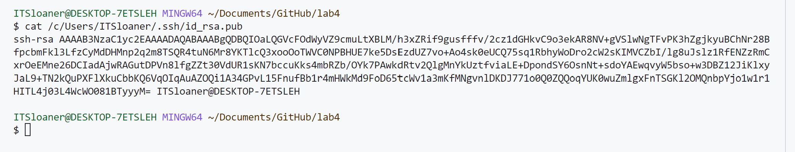
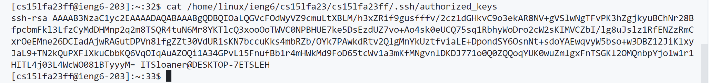
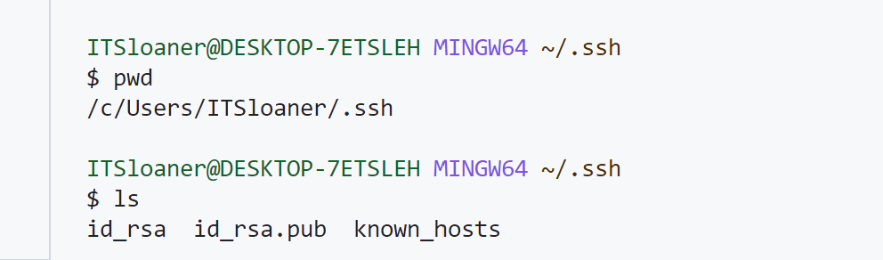
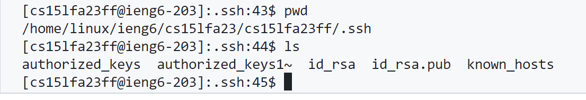
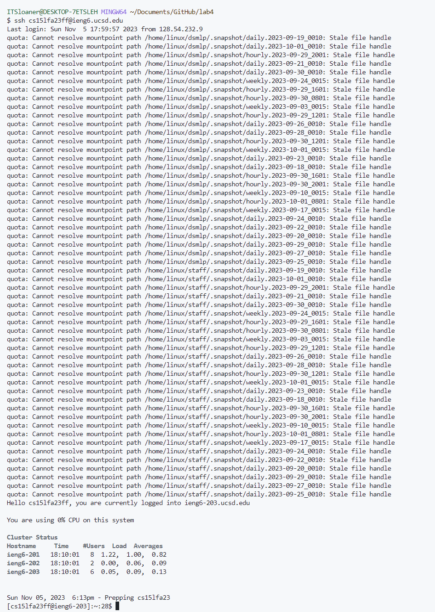

# Lab Report  2
## Zeke Wang

### Part 1

This is the code: 
````
import java.io.IOException;
import java.net.URI;

class Handler implements URLHandler {
    int num = 0;
    String msg = "";

    public String handleRequest(URI url) {
        if (url.getPath().equals("/")) {
            return String.format(msg); 
        } else {
            if (url.getPath().contains("/add-message")) {
                String[] parameters = url.getQuery().split("=");
                if (parameters[0].equals("s")) {
                    num++;
                    return msg = msg+String.format(num + ". " + parameters[1] + "\n");
                }
            }
            return "404 Not Found!";
        }
    }
}

class StringServer {
    public static void main(String[] args) throws IOException {
        if(args.length == 0){
            System.out.println("Missing port number! Try any number between 1024 to 49151");
            return;
        }

        int port = Integer.parseInt(args[0]);

        Server.start(port, new Handler());
    }
}
````


- The method in my code that was called is public String handleRequest(URI url) {...}
- The argument for handleRequest is a URL. The method checks the URL for the /add-message path. If not detected it will return nothing, and if detected it will add the message into a string array, which then is returned with the value as the message in the URL in the format of an element in the string array.
- The argument changes whatever was inputted into the query into a string value and displays it when the page updates. The expected value is 5. much which is demonstrated in the screenshot. 


- The method in my code that was called is public String handleRequest(URI url) {...}
- The argument for handleRequest is a URL. The method checks the URL for the /add-message path. If not detected it will return nothing, and if detected it will add the message into a string array, which then is returned with the value as the message in the URL in the format of an element in the string array.
- Any value inputted for the query becomes a String. This screenshot shows that integer, double, and URL are all converted to String.


### Part 2



These two images show that local and remote have the same key, which shows the path to the public key to log into ieng6 remote computer. 




These two images show the pwd and ls outputs from both the remote and local computers. The screenshots show the absolute path for the key. 



This screenshot shows that I can log in without being prompted to type my password. 


### Part 3
In weeks 2 and 3 of the lab, I discovered how surprisingly straightforward it is to start and access remote servers and computers. With the right commands and a basic understanding of the concepts, I learned that I could establish remote connections and manage distant computers with ease. I thought that starting a page that other people could access would be a lot of work and effort, and it is interesting to me that not a whole lot of effort is required; even I can start a server that is accessible to people who have the URL and internet. I also find it interesting that I can very easily access computers remotely as well. 
