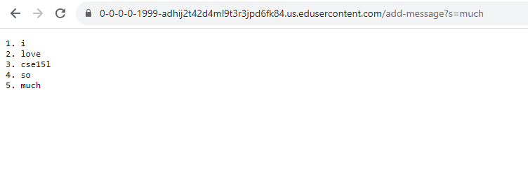
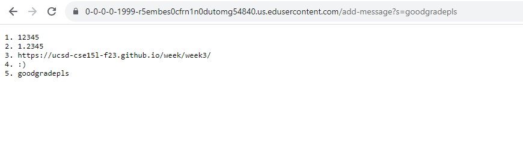

# Lab Report  2
## Zeke Wang

##Part 1
````
import java.io.IOException;
import java.net.URI;

class Handler implements URLHandler {
    int num = 0;
    String msg = "";

    public String handleRequest(URI url) {
        if (url.getPath().equals("/")) {
            return String.format(msg); 
        } else {
            if (url.getPath().contains("/add-message")) {
                String[] parameters = url.getQuery().split("=");
                if (parameters[0].equals("s")) {
                    num++;
                    return msg = msg+String.format(num + ". " + parameters[1] + "\n");
                }
            }
            return "404 Not Found!";
        }
    }
}

class StringServer {
    public static void main(String[] args) throws IOException {
        if(args.length == 0){
            System.out.println("Missing port number! Try any number between 1024 to 49151");
            return;
        }

        int port = Integer.parseInt(args[0]);

        Server.start(port, new Handler());
    }
}
````


- The method in my code that was called is public String handleRequest(URI url) {...}
- The argument for handleRequest is a URL. The method checks the URL for the /add-message path. If not detected it will return nothing, and if detected it will add the message into a string array, which then is returned with the value as the message in the URL in the format of an element in the string array.
- The argument changes whatever was inputted into the query into a string value and displays it when the page updates. The expected value is 5. much which is demonstrated in the screenshot. 



- The method in my code that was called is public String handleRequest(URI url) {...}
- The argument for handleRequest is a URL. The method checks the URL for the /add-message path. If not detected it will return nothing, and if detected it will add the message into a string array, which then is returned with the value as the message in the URL in the format of an element in the string array.
- Any value inputted for the query becomes a String. This screenshot shows that integer, double, and URL are all converted to String. 
