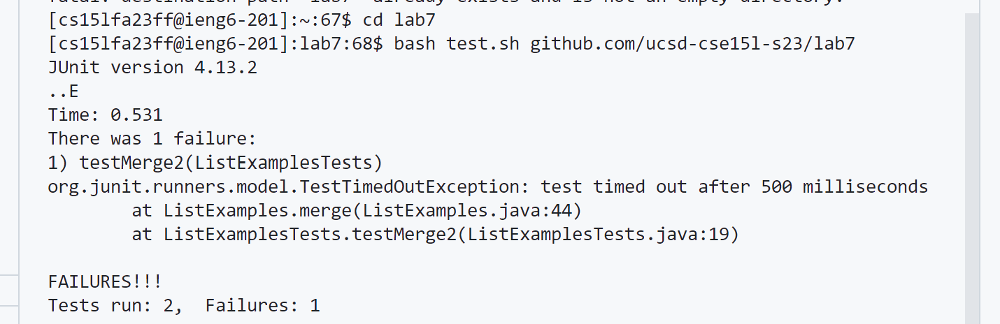
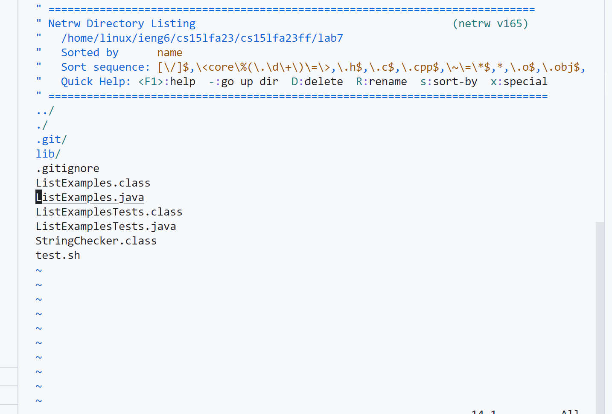
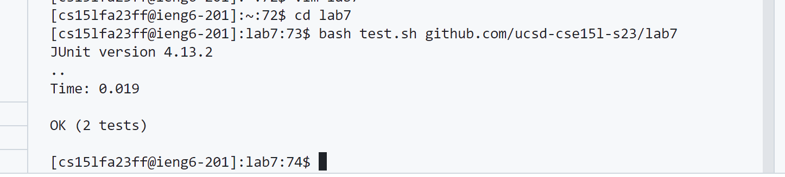

# Lab Report  3
## Zeke Wang


Keys pressed:
1. ssh cs15lfa23ff@ieng6.ucsd.edu
2. password ```<enter>```
4. git clone https://github.com/ucsd-cse15l-s23/lab7 <enter>



Keys pressed:
1. cd lab7 <enter>
2. bash test.sh github.com/ucsd-cse15l-s23/lab7 <enter>



Keys pressed:
1. cd <enter>
2. vim lab7 <enter>
3. <j> until curser on ListExample.java <enter>


Keys pressed:
1. <j> , <k> , and <l> until curser is on index1
2. <i>
3. <backspace>
4. 2
5. <escape>
6. :wq and <enter>



Keys pressed:
1. cd lab7
2. bash test.sh github.com/ucsd-cse15l-s23/lab7 <enter>
