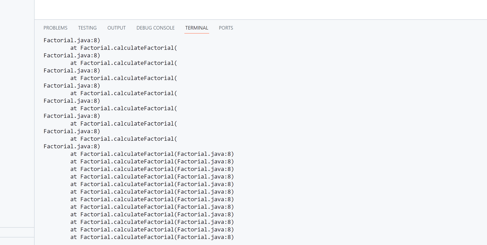
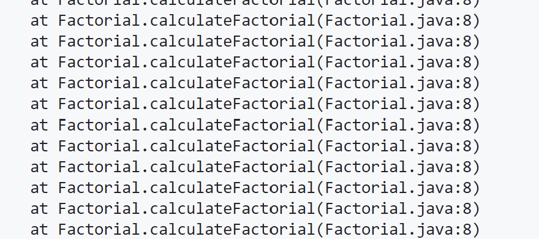
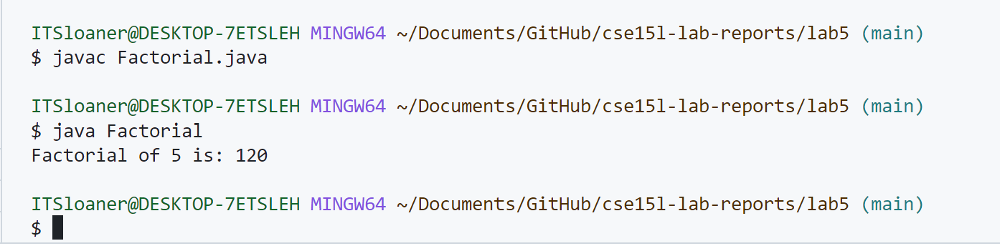

# Lab Report  2
## Zeke Wang

### Part 1

Student's original post: 
Hello everyone, I have an issue with my java program. I'm trying to calculate the factorial of a number, but when I run my code, I get an infinite loop of error messages. Here's a screenshot of the error and my code: 

code: 
```
public class Factorial {
    public static void main(String[] args) {
        int n = 5;
        System.out.println("Factorial of " + n + " is: " + calculateFactorial(n));
    }

    public static int calculateFactorial(int num) {
        return num * calculateFactorial(num - 1); // Error: Infinite recursion
    }
}
```
Error screenshot: 



TA's response: 
It looks like your program is encountering a StackOverflowError due to infinite recursion in your calculateFactorial method. To debug, try running your program with a smaller input value. Also, take a look at your calculateFactorial method and ensure there's a base case to break out of the recursion.

Uses these commands to compile and run your program with a smaller input value again: 
```
javac Factorial.java
java Factorial
```

Student's follow up: 
After running my program with a smaller input value, indeed, I'm getting the same infinite loop of error messages. Here's a screenshot of the terminal output:



To fix this, I will add a base case to stop the recursion when n is less or equal to 1. Here is the updated code and screenshot that it no longer has the error message: 

Code:
```
public class Factorial {
    public static void main(String[] args) {
        int n = 5;
        System.out.println("Factorial of " + n + " is: " + calculateFactorial(n));
    }

    public static int calculateFactorial(int num) {
        if (num <= 1) {
            return 1;
        } else {
            return num * calculateFactorial(num - 1);
        }
    }
}
```

Here is a screenshot that it work without the error: 


